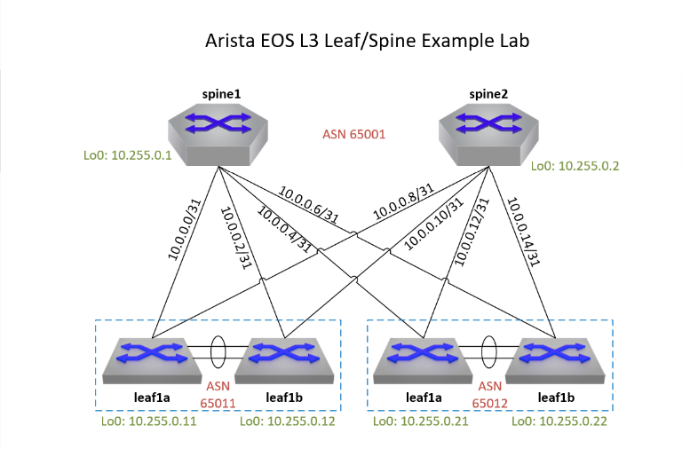

# Running a local ContainerLab environment - Arista cEOS L3 Leaf-Spine Lab

A complete ContainerLab topology running Arista cEOS 4.35.4M in a 2-spine / 2-leaf-pair (MLAG) architecture, with step-by-step instruction for both Windows and MacOS.

---

## Demo Topology Overview 



This environment is meant to be an example deployment as an initial ContainerLab environment. The network is a simple L3 Leaf-Spine design with two pairs of MLAG (multi-chassis link aggregation) switch pairs connecting to a two-switch spine. eBGP is established between each leaf switch and each spine, and iBGP is established between the leaf pairs. ECMP (Equal-Cost Multi-Pathing) is enabled for increased bandwidth and improved redundancy.

Individual device configuration "startup-config" files can be found in the `configs` directory in the repo. Please review the `lab.clab.yaml` file for the ContainerLab topology and design details.

### Address Summary

| Device  | Loopback0       | BGP AS |
|---------|-----------------|--------|
| spine1  | 10.255.0.1/32   | 65001  |
| spine2  | 10.255.0.2/32   | 65001  |
| leaf1a  | 10.255.0.11/32  | 65011  |
| leaf1b  | 10.255.0.12/32  | 65011  |
| leaf2a  | 10.255.0.21/32  | 65012  |
| leaf2b  | 10.255.0.22/32  | 65012  |


### Uplink connections

| Link               | Subnet         | Addresses             |
|--------------------|----------------|-----------------------|
| spine1 ↔ leaf1a    | 10.0.0.0/31    | .0 / .1               |
| spine1 ↔ leaf1b    | 10.0.0.2/31    | .2 / .3               |
| spine1 ↔ leaf2a    | 10.0.0.4/31    | .4 / .5               |
| spine1 ↔ leaf2b    | 10.0.0.6/31    | .6 / .7               |
| spine2 ↔ leaf1a    | 10.0.0.8/31    | .8 / .9               |
| spine2 ↔ leaf1b    | 10.0.0.10/31   | .10 / .11             |
| spine2 ↔ leaf2a    | 10.0.0.12/31   | .12 / .13             |
| spine2 ↔ leaf2b    | 10.0.0.14/31   | .14 / .15             |

### Leaf MLAG Links
| MLAG Peers         | MLAG 4094 Subnet| MLAG Peer Links       |
|--------------------|-----------------|-----------------------|
| leaf1a ↔ leaf1b    | 10.255.255.0/30 | MLAG peer (Po100, eth3+eth4); leaf1a:.1 / leaf1b:.2 |
| leaf2a ↔ leaf2b    | 10.255.255.0/30 | MLAG peer (Po100, eth3+eth4); leaf2a:.1 / leaf2b:.2 |


### Host Connections

| Host  | VLAN | Subnet            | Host IP         | vARP Gateway  | Local SVI (a/b)             | Uplinks (LACP Po10)         |
|-------|------|-------------------|-----------------|---------------|-----------------------------|-----------------------------|
| host1 | 100  | 192.168.100.0/24  | 192.168.100.10  | 192.168.100.1 | leaf1a:.2 / leaf1b:.3       | eth1→leaf1a:e10, eth2→leaf1b:e10 |
| host2 | 200  | 192.168.200.0/24  | 192.168.200.10  | 192.168.200.1 | leaf2a:.2 / leaf2b:.3       | eth1→leaf2a:e10, eth2→leaf2b:e10 |

> **Note:** Host LACP bonding requires the Linux `bonding` kernel module. On WSL2, run `sudo modprobe bonding` before deploying the lab if the module is not already loaded.

### Default Credentials

| Username | Password |
|----------|----------|
| admin    | admin    |


---
# Windows Install Guide


## Prerequisites

- Windows 11 (64-bit) with virtualization enabled in BIOS
- 16 GB RAM minimum (6 cEOS nodes × ~1.5 GB each)
- 20 GB free disk space
- An [Arista support account](https://www.arista.com/en/user-registration) to download cEOS


## Setup Guide

Follow these guides in order:

1. [Install WSL2 and Docker Desktop](docs/01-wsl-docker.md)
2. [Install ContainerLab](docs/02-containerlab-install.md)
3. [Download and import the cEOS 4.35.4M image](docs/03-ceos-image.md)
4. [Install the VSCode ContainerLab extension](docs/04-vscode-extension.md)
5. [Clone this repo and run the lab](docs/05-running-the-lab.md)


## Quick Start (after setup)

```bash
# In your WSL2 Ubuntu terminal
git clone https://github.com/williamtgoss/arista-ceos-leaf-spine-lab.git arista-leaf-spine
cd arista-leaf-spine

# Deploy the lab
sudo containerlab deploy -t lab.clab.yaml

# Verify BGP on spine1
docker exec -it clab-arista-leaf-spine-spine1 Cli -c "show bgp summary"

# Verify MLAG on leaf1a
docker exec -it clab-arista-leaf-spine-leaf1a Cli -c "show mlag"

# Destroy the lab when done
sudo containerlab destroy -t lab.clab.yaml
```
---

# MacOS Install Guide
 more details to come.

---


## Repository Structure

```
.
├── lab.clab.yaml          # ContainerLab topology definition
├── configs/
│   ├── spine1/startup-config
│   ├── spine2/startup-config
│   ├── leaf1a/startup-config
│   ├── leaf1b/startup-config
│   ├── leaf2a/startup-config
│   └── leaf2b/startup-config
└── docs/
    ├── 01-wsl-docker.md
    ├── 02-containerlab-install.md
    ├── 03-ceos-image.md
    ├── 04-vscode-extension.md
    └── 05-running-the-lab.md
```
